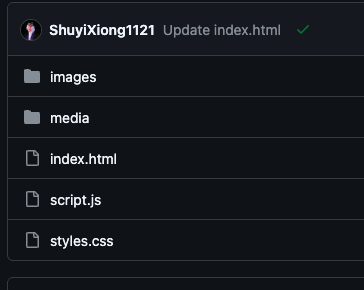

#Final Project - Artist Personal Website

## 1 Structure Overview
As written in the proposal, I aimed to create a personal website that contains my info and my music pieces. In order to improve the UI and styling, I need to introduce CSS and JavaScript into my website. Therefore, I started by creating html, js and css file in my respository.

The website also needs to have my profile picture, my avatar, and my music projects. I created 2 folders, one for image and one for media.

